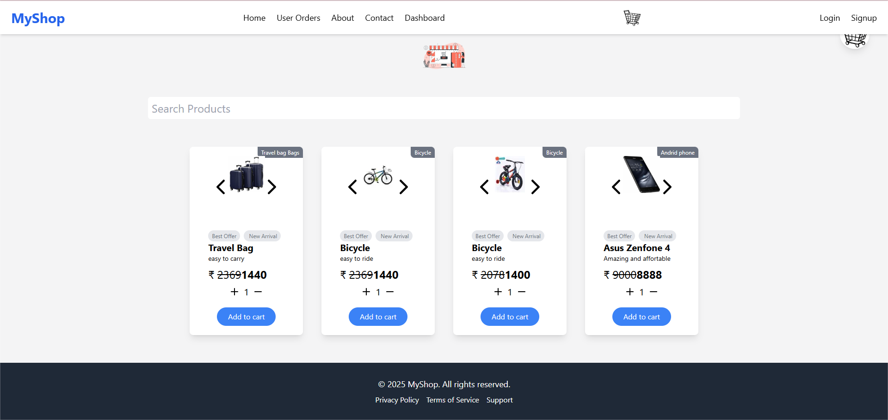
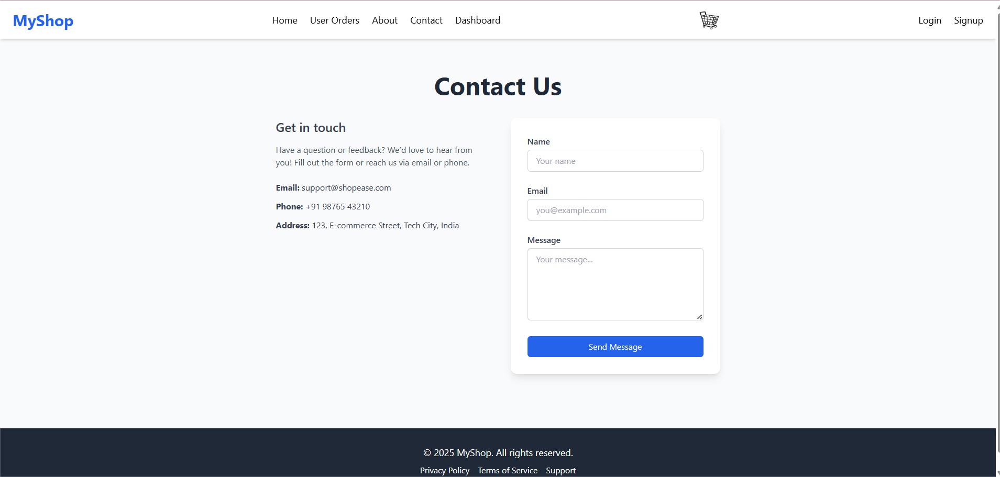

##  e-Commerce-Website
This is an FullStack Ecommerce-Webite ,I have used all the major Languages to build this working website.

 
<a href="https://ecommerce-website-2-client.onrender.com"><strong><u>Go to Live Website</u></strong></a>

## Languages Used
- Html & Css
- JavaScript
- React
- Tailwind-css
- MongoDb Connection

## What's new in Here

So,Basically it's an ecommerce-website with backend Compatibility to store the data and function properly.

### What you can do 
- you can Signup and Login  using credentials.
- you can order product ,add to cart .
- you can change the details.
- you can contact us through social-media accounts.
